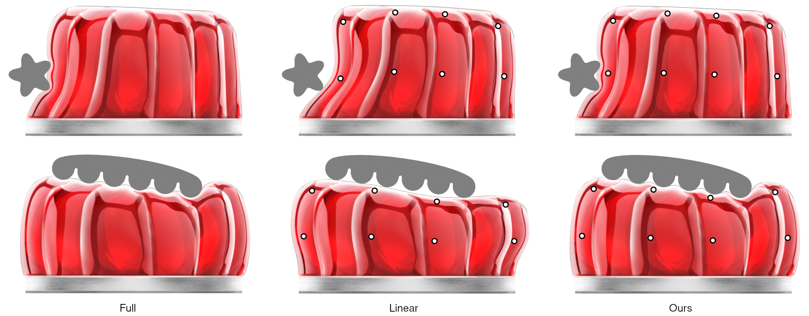
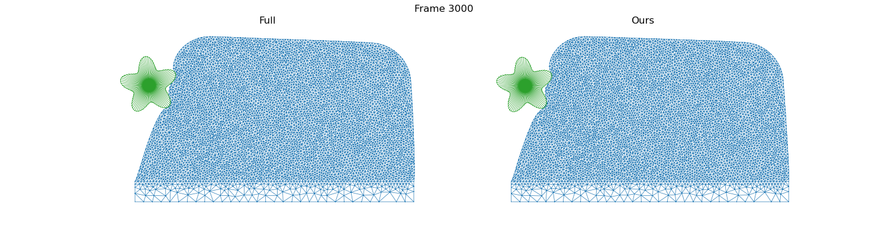

# Learning Contact Corrections for Handle-Based Subspace Dynamics



[[Project website](http://mslab.es/projects/LearningContactCorrections/)] [[Video](https://www.youtube.com/watch?v=TkCgp-npHXg)] [[Data](https://urjc-my.sharepoint.com/:f:/g/personal/cristian_romero_urjc_es/Et30gmexC45Mn-OCDo_DdHwB3Y9Skd-S5LDdgjrl_oMNrg?e=9tDYNZ)] [[Trained models](https://urjc-my.sharepoint.com/:f:/g/personal/cristian_romero_urjc_es/EnX3s69LTkBNgIqYb-bpoicBLoZ6kmKLppcxHMo8gHPWWg?e=bGAlsa)] 

## Abstract

> This paper introduces a novel subspace method for the simulation of dynamic deformations. The method augments existing linear handle-based subspace formulations with nonlinear learning-based corrections parameterized by the same subspace. Together, they produce a compact nonlinear model that combines the fast dynamics and overall contact-based interaction of subspace methods, with the highly detailed deformations of learning-based methods. We propose a formulation of the model with nonlinear corrections applied on the local undeformed setting, and decoupling internal and external contact driven corrections. We define a simple mapping of these corrections to the global setting, an efficient implementation for dynamic simulation, and a training pipeline to generate examples that efficiently cover the interaction space. Altogether, the method achieves unprecedented combination of speed and contact-driven deformation detail.

**Project structure**:
```
hsd-learning-contact-corrections
│
└───assets 
|    └─ images
|    └─ textures
|
└───data 
|    └─ interaction.h5         # Interactive session data (external download)
|    └─ meshes.h5              # Mesh data (external download)
|    └─ dataset.h5             # Learning data (external download)
|
└───trained_models 
     └─ model_*.pt             # PyTorch trained models (external download)     
```

# Running the model

**Requirements**: ```python3```, ```h5py```, ```torch```, ```numpy```

## Download interactive session data

1. Download the simulation frames recorded during an interactive jelly + star demo session: [interaction.h5](https://urjc-my.sharepoint.com/:u:/g/personal/cristian_romero_urjc_es/EY-4fXejb_1DjrYoFeN3rNgBJb_wxEE3S-ASLCr4dceXpA?e=HKqGjB)
2. Create ```data``` directory and move the file there.

The ```.h5``` file contains the following data:

| Key   | Description                        | Dimension                          |
|-------|------------------------------------|------------------------------------|
| *q*   | Handle transformations             | [num_frames, num_handle_rows, dim] |
| *z*   | Collider transformation            | [num_frames, dim+1, dim]           |
| *x*   | Simulated node positions           | [num_frames, num_jelly_nodes, dim] |

This data can be efficiently accesed with the ```h5py``` package:

```python
import h5py

# load interaction data
interaction  = h5py.File("data/interaction.h5", mode='r')

# get handle and collider transformations for an arbitrary frame number
frame = 3000
q = interaction["q"][frame]
z = interaction["z"][frame]

# get node positions of the full dynamic simulation
x_full = interaction["x"][frame]
```

## Download trained model

1. Download the trained model for the jelly + star demo (cpu and cuda versions available): [model_cpu.pt](https://urjc-my.sharepoint.com/:f:/g/personal/cristian_romero_urjc_es/EnX3s69LTkBNgIqYb-bpoicBLoZ6kmKLppcxHMo8gHPWWg?e=EaNjFp)
2. Create ```trained_models``` directory and move model there.

The models are already traced and can be easily loaded with the ```torch``` package:

```python
import torch

model = torch.jit.load("trained_models/model_cpu.pt")
```
## Generate model results

Our model can be evaluated for individual or batched inputs:

```python
import numpy

q_torch = torch.from_numpy(q)
z_torch = torch.from_numpy(z)

x_ours_torch = model(q_torch, z_torch)

x_ours = x_ours_torch.detach().numpy()
```

# Visualization

**Requirements**: ```matplotlib```

1. Download the meshes of the jelly + star demo: [meshes.h5](https://urjc-my.sharepoint.com/:u:/g/personal/cristian_romero_urjc_es/EUHKu3461yNEjE9-j7yA5xsBSz8Uyd6KlctZL0vZbzQUdw?e=71f3dI)
2. Move the file to ```data``` directory.

The```.h5``` file contains the following data:

| Key          | Key      | Description                        | Dimension                           |
|--------------|----------|------------------------------------|-------------------------------------|
|  *jelly*     | *W*      | Linear basis (BGBC)                | [num_jelly_nodes, num_handle_rows]  |
|              | *q_ref*  | Reference transformations          | [num_handle_rows, dim]              |
|              | *tris*   | Triangle indices                   | [num_jelly_tris, dim+1]             |
|  *star*      | *W*      | Linear basis (rigid)               | [num_star_nodes, dim+1]             |
|              | *z_ref*  | Reference transformation           | [dim+1, dim]                        |
|              | *tris*   | Triangle indices                   | [num_star_tris, dim+1]              |

Using this information, the results of the model can be easily visualized with the plotting package ```matplotlib```:

```python

import matplotlib.pyplot as plt

# setup side by side plots
fig, axs = plt.subplots(1,2,figsize=(15, 4))
fig.suptitle("Frame " + str(frame))

# load mesh data
meshes = h5py.File("data/meshes.h5", mode='r')

triangles_jelly = meshes["jelly"]["tris"]
triangles_star = meshes["star"]["tris"]
W_star = meshes["star"]["W"]

# transform star 
x_star = numpy.matmul(W_star, z)

# plot full 
axs[0].set_title('Full')
axs[0].axis('equal')
axs[0].set_axis_off()

axs[0].triplot(x_full[:,0], x_full[:,1], triangles_jelly, linewidth=0.5)
axs[0].triplot(x_star[:,0], x_star[:,1], triangles_star, linewidth=0.5)

# plot ours 
axs[1].set_title('Ours')
axs[1].axis('equal')
axs[1].set_axis_off()

axs[1].triplot(x_ours[:,0], x_ours[:,1], triangles_jelly, linewidth=0.5)
axs[1].triplot(x_star[:,0], x_star[:,1], triangles_star, linewidth=0.5)

plt.show()
```



To obtain more fancy results you can apply the jelly texture of the paper: [assets/textures/jelly.png](https://github.com/crisrom002/hsd-learning-contact-corrections/blob/main/assets/textures/jelly.png)

# Dataset

You can also download the dataset used for learning the jelly + star demo: [dataset.h5](https://urjc-my.sharepoint.com/:u:/g/personal/cristian_romero_urjc_es/ETSvhdReOF5JkKTlK476hwkBmUFQm24-CEziQjrCan7qtg?e=rSOyTA)

The```.h5``` file contains the following data:

| Key    | Description                   | Dimension                            |
|--------|-------------------------------|--------------------------------------|
| *q*    | Handle transformations        | [num_samples, num_handle_rows, dim]  |
| *z*    | Collider transformation       | [num_samples, dim+1, dim]            |
| *x*    | Simulated node positions      | [num_samples, num_jelly_nodes, dim]  |

# Citation

```
@article {romero2021subspacelearning,
    author  = {Romero, Cristian and Casas, Dan and Pérez, Jesús and Otaduy, Miguel A.},
    title   = {{Learning Contact Corrections for Handle-Based Subspace Dynamics}},
    number  = "4",
    volume  = "40",
    journal = {ACM Transactions on Graphics (Proc. of ACM SIGGRAPH)},
    year    = {2021}
}
```
